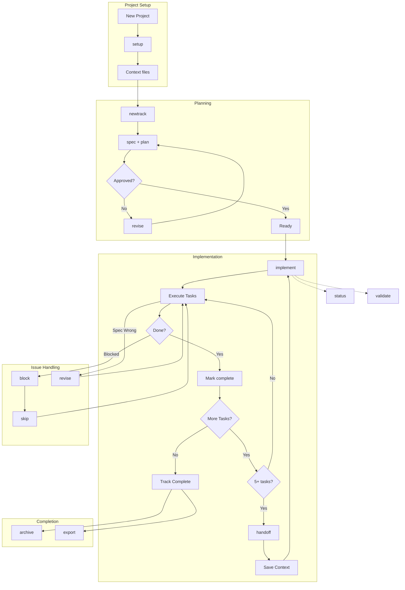

# Conductor

**Measure twice, code once.**

Conductor enables **Context-Driven Development** for AI coding assistants. It turns your AI assistant into a proactive project manager that follows a strict protocol to specify, plan, and implement software features and bug fixes.

**Works with:** [Gemini CLI](#gemini-cli) | [Claude Code](#claude-code) | [Agent Skills compatible CLIs](#agent-skills)

Instead of just writing code, Conductor ensures a consistent, high-quality lifecycle for every task: **Context -> Spec & Plan -> Implement**.

The philosophy behind Conductor is simple: control your code. By treating context as a managed artifact alongside your code, you transform your repository into a single source of truth that drives every agent interaction with deep, persistent project awareness.

## Features

- **Plan before you build**: Create specs and plans that guide the agent for new and existing codebases.
- **Maintain context**: Ensure AI follows style guides, tech stack choices, and product goals.
- **Iterate safely**: Review plans before code is written, keeping you firmly in the loop.
- **Work as a team**: Set project-level context for your product, tech stack, and workflow preferences that become a shared foundation for your team.
- **Build on existing projects**: Intelligent initialization for both new (Greenfield) and existing (Brownfield) projects.
- **Smart revert**: A git-aware revert command that understands logical units of work (tracks, phases, tasks) rather than just commit hashes.
- **Pause/Resume**: Implementation state is persisted, allowing you to pause work and resume later across sessions.
- **Track Dependencies**: Define dependencies between tracks to enforce implementation order.
- **Priority Management**: Assign priority levels (critical, high, medium, low) to tracks.
- **Blocker Tracking**: Mark tasks as blocked with `[!]` marker and track reasons.
- **Project Validation**: Validate conductor directory integrity and fix issues automatically.

## Installation

### Gemini CLI

```bash
gemini extensions install https://github.com/gemini-cli-extensions/conductor --auto-update
```

### Claude Code

**From marketplace (recommended):**
```bash
# Add the marketplace
/plugin marketplace add jasonkneen/conductor

# Install the plugin
/plugin install conductor
```

**Manual installation:**
```bash
# Clone and copy commands/skills to your global config
git clone https://github.com/gemini-cli-extensions/conductor.git
cp -r conductor/.claude/commands/* ~/.claude/commands/
cp -r conductor/.claude/skills/* ~/.claude/skills/
```

This installs 10 slash commands and a skill that auto-activates for conductor projects.

### Agent Skills

For CLIs supporting the [Agent Skills specification](https://agentskills.io), point to:

```
skills/conductor/
├── SKILL.md
└── references/
    ├── workflows.md    # Detailed command workflows
    └── structure.md    # Directory layout and status markers
```

### Project-Local Installation

Copy to any project for project-scoped Claude Code support:
```bash
cp -r /path/to/conductor/.claude your-project/
```

## Usage

Conductor is designed to manage the entire lifecycle of your development tasks.

**Note on Token Consumption:** Conductor's context-driven approach involves reading and analyzing your project's context, specifications, and plans. This can lead to increased token consumption, especially in larger projects or during extensive planning and implementation phases. You can check the token consumption in the current session by running `/stats model`.

### 1. Set Up the Project (Run Once)

When you run `/conductor:setup`, Conductor helps you define the core components of your project context. This context is then used for building new components or features by you or anyone on your team.

- **Product**: Define project context (e.g. users, product goals, high-level features).
- **Product guidelines**: Define standards (e.g. prose style, brand messaging, visual identity).
- **Tech stack**: Configure technical preferences (e.g. language, database, frameworks).
- **Workflow**: Set team preferences (e.g. TDD, commit strategy). Uses [workflow.md](templates/workflow.md) as a customizable template.

**Generated Artifacts:**
- `conductor/product.md`
- `conductor/product-guidelines.md`
- `conductor/tech-stack.md`
- `conductor/workflow.md`
- `conductor/code_styleguides/`
- `conductor/tracks.md`

```bash
/conductor:setup
```

### 2. Start a New Track (Feature or Bug)

When you're ready to take on a new feature or bug fix, run `/conductor:newTrack`. This initializes a **track** — a high-level unit of work. Conductor helps you generate two critical artifacts:

- **Specs**: The detailed requirements for the specific job. What are we building and why?
- **Plan**: An actionable to-do list containing phases, tasks, and sub-tasks.

**New in v0.2.0:** You can now set:
- **Priority**: Critical, High, Medium, or Low
- **Dependencies**: Link tracks that must complete first
- **Time Estimates**: Estimated hours for planning

**Generated Artifacts:**
- `conductor/tracks/<track_id>/spec.md`
- `conductor/tracks/<track_id>/plan.md`
- `conductor/tracks/<track_id>/metadata.json`

```bash
/conductor:newTrack
# OR with a description
/conductor:newTrack "Add a dark mode toggle to the settings page"
```

### 3. Implement the Track

Once you approve the plan, run `/conductor:implement`. Your coding agent then works through the `plan.md` file, checking off tasks as it completes them.

**Updated Artifacts:**
- `conductor/tracks.md` (Status updates)
- `conductor/tracks/<track_id>/plan.md` (Status updates)
- `conductor/tracks/<track_id>/implement_state.json` (Progress tracking)
- Project context files (Synchronized on completion)

```bash
/conductor:implement
```

Conductor will:
1.  Check for dependencies and warn if any are incomplete.
2.  Resume from last position if a previous session was interrupted.
3.  Select the next pending task.
4.  Follow the defined workflow (e.g., TDD: Write Test -> Fail -> Implement -> Pass).
5.  Update the status in the plan as it progresses.
6.  **Verify Progress**: Guide you through a manual verification step at the end of each phase to ensure everything works as expected.
7.  Sync project documentation on track completion.
8.  Offer to archive or delete completed tracks.

## Status Markers

Throughout conductor files:
- `[ ]` - Pending/New
- `[~]` - In Progress
- `[x]` - Completed (with commit SHA)
- `[!]` - Blocked (with reason)

**Blocker Format:**
```markdown
- [!] Task name [BLOCKED: Waiting for API credentials]
```

## Workflow Diagrams

### Complete Workflow



### Quick Reference Patterns

| Pattern | Command Flow |
|---------|--------------|
| **Happy Path** | `setup` → `newtrack` → `implement` → `archive` |
| **Multi-Section** | `implement` → *(5+ tasks)* → `handoff` → *(new session)* → `implement` |
| **Handle Blockers** | `implement` → `block` → `skip` or wait → `implement` |
| **Mid-Track Changes** | `implement` → `revise` → `implement` |
| **Monitoring** | `status` / `validate` *(anytime)* |
| **Context Drift** | `refresh` *(when codebase changed outside Conductor)* |

## Commands Reference

### Core Commands

| Gemini CLI | Claude Code | Description |
| :--- | :--- | :--- |
| `/conductor:setup` | `/conductor-setup` | Initialize project with product.md, tech-stack.md, workflow.md |
| `/conductor:newTrack` | `/conductor-newtrack` | Create new feature/bug track with spec.md and plan.md |
| `/conductor:implement` | `/conductor-implement` | Execute tasks from the current track's plan |
| `/conductor:status` | `/conductor-status` | Display progress overview with priority grouping |
| `/conductor:revert` | `/conductor-revert` | Git-aware revert of tracks, phases, or tasks |

### New Commands (v0.2.0)

| Gemini CLI | Claude Code | Description |
| :--- | :--- | :--- |
| `/conductor:validate` | `/conductor-validate` | Validate project integrity, find orphan tracks, fix issues |
| `/conductor:block` | `/conductor-block` | Mark a task as blocked with a reason |
| `/conductor:skip` | `/conductor-skip` | Skip current task and move to next |
| `/conductor:revise` | `/conductor-revise` | Update spec/plan when implementation reveals issues |
| `/conductor:archive` | `/conductor-archive` | Archive completed tracks to `conductor/archive/` |
| `/conductor:export` | `/conductor-export` | Generate comprehensive project summary as markdown |
| `/conductor:handoff` | `/conductor-handoff` | Create context handoff for section transfer |
| `/conductor:refresh` | `/conductor-refresh` | Sync context docs with current codebase state |

Projects set up with either tool are fully interoperable.

## Project Structure

```
conductor/
├── product.md              # Product vision, users, goals
├── product-guidelines.md   # Brand/style guidelines
├── tech-stack.md           # Technology choices
├── workflow.md             # Development standards (TDD, commits, coverage)
├── tracks.md               # Master track list with status markers
├── setup_state.json        # Setup progress tracking
├── refresh_state.json      # Context refresh tracking
├── code_styleguides/       # Language-specific style guides
├── archive/                # Archived completed tracks
└── tracks/
    └── <track_id>/         # Format: shortname_YYYYMMDD
        ├── metadata.json   # Track type, status, priority, dependencies
        ├── spec.md         # Requirements and acceptance criteria
        ├── plan.md         # Phased task list with status
        ├── handoff_*.md    # Section handoff documents
        ├── revisions.md    # Revision history log
        └── implement_state.json  # Resume state (auto-managed)
```

### metadata.json Schema

```json
{
  "track_id": "auth_20241219",
  "type": "feature",
  "status": "new",
  "priority": "high",
  "depends_on": ["setup_20241218"],
  "estimated_hours": 8,
  "actual_hours": null,
  "created_at": "2024-12-19T10:00:00Z",
  "updated_at": "2024-12-19T10:00:00Z",
  "description": "User authentication system"
}
```

## Single Source of Truth

Core workflow definitions are maintained in `workflows/`:

```
workflows/
├── README.md                    # How workflows are used
├── setup.md                     # Setup workflow logic
├── newtrack.md                  # New track workflow logic
├── implement.md                 # Implementation workflow logic
├── status.md                    # Status workflow logic
├── revert.md                    # Revert workflow logic
├── validate.md                  # Validation workflow logic
└── schemas/
    ├── metadata.schema.json     # Track metadata schema
    ├── setup_state.schema.json  # Setup state schema
    └── implement_state.schema.json  # Implementation state schema
```

## Resources

- [Manual Workflow Guide](docs/manual-workflow-guide.md): Step-by-step guide for using commands without skills
- [Beads Integration](docs/BEADS_INTEGRATION.md): Persistent task memory integration
- [Claude Code README](.claude/README.md): Detailed Claude Code installation and usage
- [Workflow Definitions](workflows/README.md): Single source of truth for workflow logic
- [Gemini CLI extensions](https://geminicli.com/docs/extensions/): Gemini CLI documentation
- [Agent Skills specification](https://agentskills.io): Open standard for AI agent skills
- [GitHub issues](https://github.com/gemini-cli-extensions/conductor/issues): Report bugs or request features

## What's New in v0.4.0

### New Features
- **Beads Integration**: Optional integration with [Beads](https://github.com/steveyegge/beads) for persistent task memory that survives conversation compaction
- **Dependency-Aware Task Selection**: Uses `bd ready` to automatically find tasks with no blockers
- **Cross-Session Memory**: Beads notes persist after context compaction, enabling seamless session resume
- **Stealth Mode Support**: Use `bd init --stealth` for local-only task tracking in shared repos

### How It Works
When Beads is detected during `/conductor:setup`, you can enable integration:
- Each Conductor track becomes a Beads epic
- Tasks sync bidirectionally between `plan.md` and Beads
- Use `bd ready` for intelligent task selection
- Notes survive context compaction

### Configuration
After setup, `conductor/beads.json` controls integration:
```json
{
  "enabled": true,
  "mode": "normal",
  "sync": "bidirectional",
  "compactOnArchive": true
}
```

See [docs/BEADS_INTEGRATION.md](docs/BEADS_INTEGRATION.md) for full details.

## What's New in v0.3.0

### New Features
- **Context Handoff**: `/conductor:handoff` creates comprehensive handoff documents for transferring implementation context between sections/sessions
- **Multi-Section Support**: Large tracks can now span multiple AI context windows with section tracking and chained handoffs
- **Auto-Handoff Detection**: Implementation workflow suggests handoff after 5+ tasks or at phase boundaries

### Improvements
- **Enhanced State Tracking**: `implement_state.json` now tracks `section_count`, `last_handoff`, and `handoff_history`
- **Better Resume Experience**: Handoff documents provide clear context and resume instructions for next session

## What's New in v0.2.0

### New Features
- **Pause/Resume Implementation**: Work is saved in `implement_state.json`, allowing you to stop and resume across sessions
- **Track Dependencies**: Define which tracks must complete before others with `depends_on` field
- **Priority Levels**: Assign priority (critical/high/medium/low) to tracks for better organization
- **Blocker Tracking**: Mark tasks as blocked with `[!]` marker and track reasons
- **Project Validation**: `/conductor:validate` checks integrity and offers auto-fixes
- **Skip Tasks**: `/conductor:skip` to skip tasks with reasons
- **Revise Plans**: `/conductor:revise` to update spec/plan when implementation reveals issues
- **Archive Tracks**: `/conductor:archive` to clean up completed tracks
- **Export Summary**: `/conductor:export` generates comprehensive project reports
- **Context Refresh**: `/conductor:refresh` to sync context docs with current codebase state

### Improvements
- **Enhanced Status Display**: Priority grouping, dependency visualization, blocker listing
- **Single Source Workflows**: Core logic in `workflows/` directory for consistency
- **Better Resume**: Detailed state tracking with phase, task index, and timestamps
- **Schema Validation**: JSON schemas for all state files

## Legal

- License: [Apache License 2.0](LICENSE)
