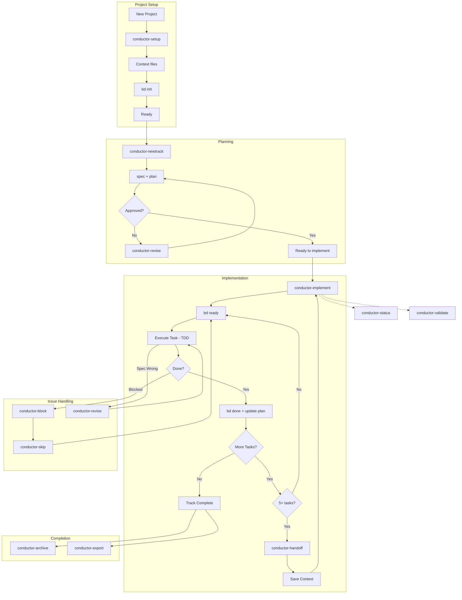
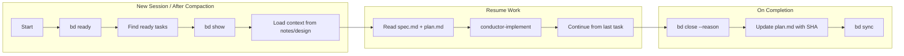
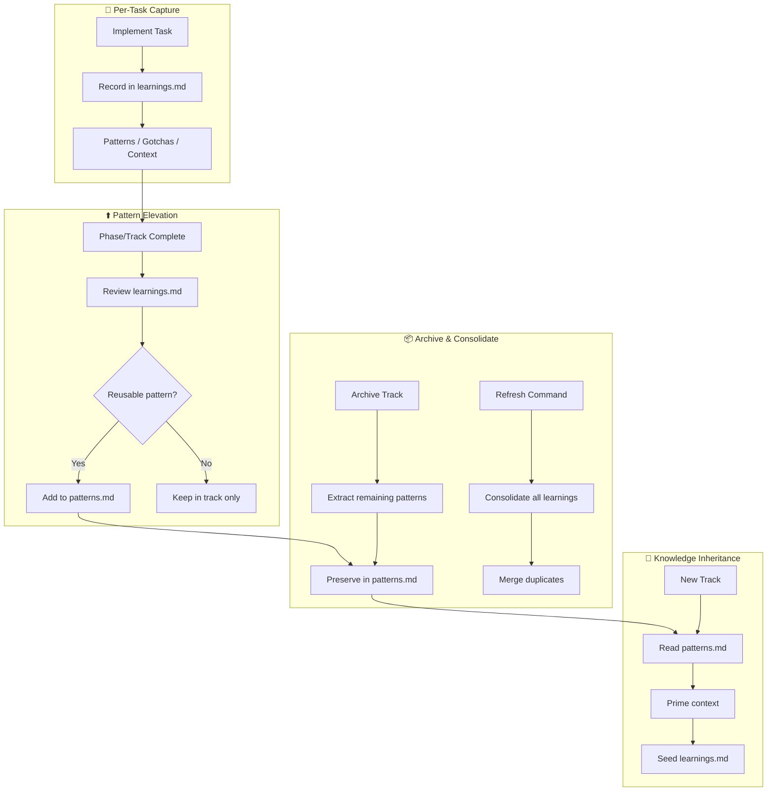

# Conductor-Beads

**Measure twice, code once.**

A unified toolkit for **Context-Driven Development** that combines structured planning with persistent memory. Turn your AI assistant into a proactive project manager that follows a strict protocol: **Context → Spec & Plan → Implement**.

**Version:** 0.1.0

## What is Conductor-Beads?

Conductor-Beads integrates two powerful systems:

- **Conductor** provides the methodology — specs, plans, tracks, and TDD workflows
- **Beads** provides the memory — persistent task tracking that survives conversation compaction

Together, they enable AI agents to manage long-horizon development tasks without losing context across sessions.

## Supported Platforms

- **Copilot CLI** - via plugin system (recommended)
- **Gemini CLI** - via extension commands (TOML)
- **Claude Code** - via slash commands and skills
- **Agent Skills compatible CLIs** - via skills specification

---

## Prerequisites

### Install Beads (Required for persistent memory)

Beads provides persistent, structured memory for coding agents. Install using one of these methods:

```bash
# npm (recommended)
npm install -g @beads/bd

# Homebrew (macOS/Linux)
brew install steveyegge/beads/bd

# Go
go install github.com/steveyegge/beads/cmd/bd@latest
```

Verify installation:
```bash
bd --version
```

> **Note:** Beads integration is always attempted for persistent memory. If the `bd` CLI is unavailable or fails, you'll be prompted to choose whether to continue without it.

---

## Installation

### Claude Code

**Full Installation** (all skills):
```bash
# Clone the repository
git clone https://github.com/NguyenSiTrung/Conductor-Beads.git

# Copy commands and skills to your global config
cp -r Conductor-Beads/.claude/commands/* ~/.claude/commands/
cp -r Conductor-Beads/.claude/skills/* ~/.claude/skills/
```

**Minimal Installation** (conductor only, smaller context):
```bash
git clone https://github.com/NguyenSiTrung/Conductor-Beads.git

# Copy only commands and conductor skill
cp -r Conductor-Beads/.claude/commands/* ~/.claude/commands/
mkdir -p ~/.claude/skills
cp -r Conductor-Beads/.claude/skills/conductor ~/.claude/skills/
```

**Project-Local Installation**:
```bash
# Full - copy entire .claude folder
cp -r Conductor-Beads/.claude your-project/

# Minimal - conductor only
mkdir -p your-project/.claude/skills
cp -r Conductor-Beads/.claude/commands your-project/.claude/
cp -r Conductor-Beads/.claude/skills/conductor your-project/.claude/skills/
```

| Installation | Includes | Best For |
|--------------|----------|----------|
| **Full** | conductor, beads, skill-creator skills | Standalone Beads usage, skill development |
| **Minimal** | conductor skill only (has Beads integration) | Most projects, smaller context window |

### Gemini CLI

```bash
gemini extensions install https://github.com/NguyenSiTrung/Conductor-Beads --auto-update
```

### Copilot CLI

**Full Installation** (all commands and skills):

```bash
# Clone the repository
git clone https://github.com/NguyenSiTrung/Conductor-Beads.git

# Copy plugin to Copilot plugins directory
mkdir -p ~/.copilot/plugins
cp -r Conductor-Beads/plugins/conductor-beads ~/.copilot/plugins/
```

**GitHub URL Installation** (recommended for auto-updates):

```bash
copilot plugin install github.com/NguyenSiTrung/Conductor-Beads/plugins/conductor-beads
```

**Minimal Installation** (conductor commands only):

```bash
git clone https://github.com/NguyenSiTrung/Conductor-Beads.git

# Copy just the conductor commands (symlinks to .claude/commands)
mkdir -p ~/.copilot/plugins/conductor-beads/.github/plugin
cp -r Conductor-Beads/plugins/conductor-beads/commands ~/.copilot/plugins/conductor-beads/
cp -r Conductor-Beads/.github/plugin ~/.copilot/plugins/conductor-beads/
```

**Project-Local Installation**:

```bash
# Full - copy entire plugin directory to your project
cp -r Conductor-Beads/plugins/conductor-beads your-project/

# Minimal - conductor commands only
mkdir -p your-project/conductor-beads/commands
cp -r Conductor-Beads/plugins/conductor-beads/commands your-project/conductor-beads/
cp -r Conductor-Beads/.github/plugin your-project/conductor-beads/
```

After installation, commands are available with the `/conductor-beads:` namespace:

```bash
/conductor-beads:setup      # Initialize project
/conductor-beads:newtrack   # Create feature/bug track  
/conductor-beads:implement  # Execute tasks from plan
```

**What's included:**
- All 16 Conductor commands
- 3 auto-activating skills (conductor, beads, skill-creator)
- Automatic updates via plugin system

---

## Setup Guide

### Step 1: Initialize Your Project

Run the setup command in your project directory:

```bash
# Claude Code
/conductor-setup

# Gemini CLI
/conductor:setup
```

This creates the `conductor/` directory with:
- `product.md` - Product vision and goals
- `tech-stack.md` - Technology choices
- `workflow.md` - Development standards (TDD, commits)
- `tracks.md` - Master track list

### Step 2: Initialize Beads

After Conductor setup, initialize Beads for persistent memory:

```bash
# Standard mode (commits to repo)
bd init

# Stealth mode (local-only, for shared repos)
bd init --stealth
```

This creates `.beads/` directory for dependency-aware task tracking.

### Step 3: Configuration

After setup, `conductor/beads.json` controls integration:
```json
{
  "enabled": true,
  "mode": "stealth",
  "sync": "bidirectional",
  "compactOnArchive": true
}
```

**Mode Options:**

| Mode | Command | Description |
|------|---------|-------------|
| `"normal"` | `bd init` | Full integration. Commits `.beads/` to repo. Team members see tasks. |
| `"stealth"` | `bd init --stealth` | Local only. `.beads/` is gitignored. Personal use on shared repos. |

Use **stealth** when working on a shared repository where you don't want to commit Beads data. Use **normal** when the whole team uses Beads.

---

## Implementation Guide

### Creating a New Track

```bash
# Claude Code
/conductor-newtrack "Add user authentication"

# Gemini CLI
/conductor:newTrack "Add user authentication"
```

This creates:
- `conductor/tracks/<track_id>/spec.md` - Requirements
- `conductor/tracks/<track_id>/plan.md` - Phased task list
- `conductor/tracks/<track_id>/metadata.json` - Track metadata
- Beads epic (if enabled): `bd-xxxx`

### Implementing a Track

```bash
# Claude Code
/conductor-implement

# Gemini CLI
/conductor:implement
```

The workflow:
1. **Load context** - Reads spec.md and plan.md
2. **Find ready tasks** - Uses `bd ready` if Beads enabled
3. **Execute TDD** - Write test → Implement → Refactor
4. **Track progress** - Updates plan.md and Beads status
5. **Verify** - Manual verification at phase boundaries

### Parallel Task Execution (New!)

For phases with independent tasks, Conductor can now execute them in parallel using sub-agents:

```markdown
## Phase 1: Core Setup
<!-- execution: parallel -->

- [ ] Task 1: Create auth module
  <!-- files: src/auth/index.ts, src/auth/index.test.ts -->
  
- [ ] Task 2: Create config module
  <!-- files: src/config/index.ts -->
```

**How it works:**
1. During `/conductor-newtrack`, you'll be asked if you want parallel execution
2. Tasks are analyzed for file conflicts and dependencies
3. During `/conductor-implement`, parallel phases spawn sub-agents
4. Each sub-agent works on exclusive files with TDD workflow
5. Results are aggregated when all workers complete

**Benefits:**
- ⚡ Faster execution for independent tasks
- 🔒 File locking prevents conflicts
- 📊 State tracking via `parallel_state.json`

See [Parallel Execution Design](docs/PARALLEL_EXECUTION.md) for details.

### Checking Status

```bash
# Claude Code
/conductor-status

# Gemini CLI
/conductor:status
```

Shows:
- Active tracks with progress
- Ready tasks (from Beads)
- Blocked items

---

## Installation Method Comparison

| Platform | Installation | Command Format | Auto-Updates | Best For |
|----------|--------------|----------------|--------------|----------|
| **Copilot CLI** | Clone + copy (or GitHub URL) | `/conductor-beads:command` | ✅ Yes (GitHub method) | Flexible setup, auto-updates available |
| **Claude Code** | Manual copy to `~/.claude/` | `/conductor-command` | ❌ No | Customization, local modifications |
| **Gemini CLI** | `gemini extensions install` | `/conductor:command` | ✅ Yes | Gemini users, extension ecosystem |

All three platforms provide the same 16 commands and functionality - only the namespace differs.

---

## Commands Reference

**Note:** Command format varies by platform:
- **Copilot CLI**: `/conductor-beads:command`
- **Claude Code**: `/conductor-command`  
- **Gemini CLI**: `/conductor:command`

Examples below use Claude Code format for brevity.

| Gemini CLI | Claude Code | Description |
|------------|-------------|-------------|
| `/conductor:setup` | `/conductor-setup` | Initialize project context |
| `/conductor:newTrack` | `/conductor-newtrack` | Create feature/bug track |
| `/conductor:implement` | `/conductor-implement` | Execute tasks from plan |
| `/conductor:status` | `/conductor-status` | Show progress overview |
| `/conductor:revert` | `/conductor-revert` | Git-aware revert |
| `/conductor:validate` | `/conductor-validate` | Validate project integrity |
| `/conductor:block` | `/conductor-block` | Mark task as blocked |
| `/conductor:skip` | `/conductor-skip` | Skip current task |
| `/conductor:revise` | `/conductor-revise` | Update spec/plan |
| `/conductor:archive` | `/conductor-archive` | Archive completed tracks |
| `/conductor:export` | `/conductor-export` | Generate project summary |
| `/conductor:handoff` | `/conductor-handoff` | Create context handoff |
| `/conductor:refresh` | `/conductor-refresh` | Sync context with codebase |
| — | `/conductor-formula` | List/manage track templates |
| — | `/conductor-wisp` | Ephemeral exploration track |
| — | `/conductor-distill` | Extract template from track |

### Essential Beads Commands

| Command | Description |
|---------|-------------|
| `bd prime` | Load AI-optimized workflow context (run first!) |
| `bd ready` | List tasks with no blockers |
| `bd create "Title" -p 0` | Create a P0 (highest priority) task |
| `bd create "Bug" --deps discovered-from:<id>` | Create and link discovered work |
| `bd show <id>` | View task details, notes, and context |
| `bd close <id> --continue` | Complete task and auto-advance to next |
| `bd update <id> --notes "context"` | Add notes for session resume |
| `bd dep add <child> <parent>` | Add dependency between tasks |
| `bd sync` | Force sync to remote (use at session end) |

### Molecule Commands (v0.34+)

| Command | Description |
|---------|-------------|
| `bd formula list` | List available workflow templates |
| `bd mol pour <template>` | Create persistent track from template |
| `bd mol wisp <template>` | Create ephemeral exploration (no audit) |
| `bd mol current` | Show current step in molecule |
| `bd mol squash <id>` | Compress completed molecule to digest |
| `bd mol distill <epic> --as "Name"` | Extract template from completed work |

---

## Skills

Located in `.claude/skills/`:

| Skill | Description |
|-------|-------------|
| **conductor** | Context-driven development methodology. Auto-activates when `conductor/` directory exists. Provides intent mapping for natural language commands. |
| **beads** | Persistent task memory that survives conversation compaction. Auto-activates when `.beads/` directory exists. Integrates with Conductor for cross-session memory. |
| **skill-creator** | Guide for creating and packaging new AI agent skills. |

### How Skills Work

Skills auto-activate based on project structure:
- `conductor/` directory → Conductor skill loads
- `.beads/` directory → Beads skill loads
- Both present → Integrated workflow enabled

Skills provide:
- **Context Loading**: Automatically reads relevant project files
- **Intent Mapping**: Converts natural language to commands
- **Proactive Behaviors**: Suggests next steps and detects issues

---

## Project Structure

### Repository Structure

```
Conductor-Beads/
├── .claude/
│   ├── commands/        # Claude Code slash commands (16)
│   └── skills/          # Skills (conductor, beads, skill-creator)
├── commands/conductor/  # Gemini CLI TOML commands (16)
├── templates/           # Workflow and styleguide templates
├── docs/                # Documentation
├── CLAUDE.md            # Claude Code context
├── GEMINI.md            # Gemini CLI context
└── gemini-extension.json
```

### Generated Project Structure

When you run Conductor on a project:

```
your-project/
├── conductor/
│   ├── product.md           # Product vision
│   ├── tech-stack.md        # Technology choices
│   ├── workflow.md          # Development standards
│   ├── tracks.md            # Master track list
│   ├── patterns.md          # Consolidated learnings (Ralph-style)
│   ├── beads.json           # Beads integration config
│   └── tracks/
│       └── <track_id>/
│           ├── spec.md      # Requirements
│           ├── plan.md      # Task list
│           ├── learnings.md # Patterns/gotchas discovered
│           └── metadata.json
└── .beads/                  # Beads data (if initialized)
```

---

## Status Markers

Throughout conductor files:
- `[ ]` - Pending/New
- `[~]` - In Progress
- `[x]` - Completed
- `[!]` - Blocked

---

## Workflow Diagrams

### Complete Workflow



### Session Resume Flow (with Beads)



### Quick Reference Patterns

| Pattern | Command Flow |
|---------|--------------|
| **Happy Path** | `setup` → `bd init` → `newtrack` → `implement` → `archive` |
| **Multi-Section** | `implement` → *(5+ tasks)* → `handoff` → *(new session)* → `implement` |
| **Handle Blockers** | `implement` → `block` → `skip` or wait → `implement` |
| **Mid-Track Changes** | `implement` → `revise` → `implement` |
| **Session Resume** | `bd ready` → `bd show --notes` → load spec → `implement` |
| **Monitoring** | `status` / `validate` *(anytime)* |
| **Context Drift** | `refresh` *(when codebase changed outside Conductor)* |

### Knowledge Flywheel (Ralph-style Learnings)

Conductor captures and consolidates learnings across tracks, inspired by [Ralph](https://github.com/snarktank/ralph):



**Key Files:**
- `conductor/patterns.md` - Project-level patterns (read before starting new work)
- `conductor/tracks/<id>/learnings.md` - Per-track discoveries (patterns, gotchas, context)

**How it works:**
1. **Capture** - After each task, learnings are appended to track's `learnings.md`
2. **Elevate** - At phase/track completion, reusable patterns move to `patterns.md`
3. **Archive** - Remaining patterns extracted before archiving
4. **Inherit** - New tracks read `patterns.md` to prime context

**Learnings Entry Format:**
```markdown
## [2025-01-09 14:30] - Phase 1 Task 2: Add auth middleware
Thread: https://ampcode.com/threads/T-xxx
- **Implemented:** JWT validation middleware
- **Files changed:** src/auth/middleware.ts, src/auth/types.ts
- **Commit:** abc1234
- **Learnings:**
  - Patterns: This codebase uses Zod for all validation
  - Gotchas: Must update index.ts barrel exports when adding modules
  - Context: Auth module owns all JWT logic
```

---

## Documentation

- [Manual Workflow Guide](docs/manual-workflow-guide.md)
- [Beads Integration](docs/BEADS_INTEGRATION.md)
- [Parallel Execution](docs/PARALLEL_EXECUTION.md)
- [Beads Official Docs](https://github.com/steveyegge/beads)

---

## Troubleshooting

### Copilot CLI Plugin Issues

**Symlinks not working on Windows:**
- Windows requires Developer Mode enabled for symlink support
- Alternative: Clone the repository and manually copy `.claude/` contents
- Or use WSL/Linux environment for full symlink support

**Commands not found after plugin install:**
- Verify installation: `copilot plugin list`
- Check command format: Use `/conductor-beads:command` (note the colon and namespace)
- Restart your IDE or terminal after installation

**Plugin update not reflecting changes:**
- Force refresh: `copilot plugin uninstall conductor-beads@conductor-beads`
- Then reinstall: `copilot plugin install conductor-beads@conductor-beads`

### General Issues

**Beads commands failing:**
- Verify Beads is installed: `bd --version`
- Initialize if needed: `bd init` or `bd init --stealth`
- Check `.beads/` directory exists in project root

**Commands showing different format:**
- This is expected - namespace varies by platform:
  - Copilot CLI: `/conductor-beads:setup`
  - Claude Code: `/conductor-setup`
  - Gemini CLI: `/conductor:setup`
- All access the same underlying commands

For more help, see [full documentation](docs/) or open an issue on GitHub.

---

## License

[Apache License 2.0](LICENSE)
