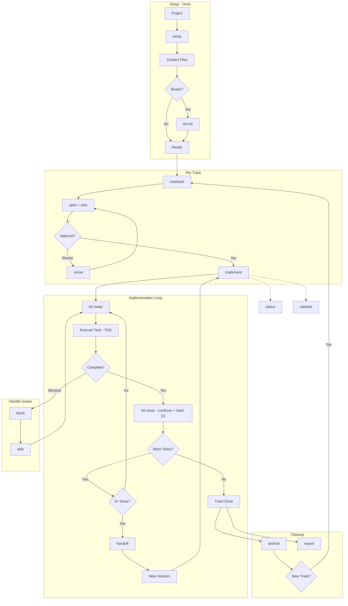

# Manual Workflow Guide

This guide explains how to work with Conductor-Beads commands manually without relying on skills or auto-activation. Use this when you need precise control over the workflow or when skills don't behave as expected.

## Workflow Overview



### Quick Reference

| Workflow | Commands |
|----------|----------|
| **Standard** | `setup` → `bd init` → `newtrack` → `implement` → `archive` |
| **Multi-Section** | `implement` → `handoff` → *(new session)* → `implement` |
| **Parallel Tasks** | `newtrack` (enable parallel) → `implement` (spawns workers) |
| **Session Resume** | `bd ready` → `bd show --notes` → `implement` |
| **Blocked Task** | `block` → `skip` or wait → continue |
| **Plan Changes** | `revise` → continue `implement` |
| **Check Status** | `status` or `validate` anytime |
| **Sync Context** | `refresh` when codebase drifts |

## Why Manual Mode?

Skills are convenient but can sometimes:
- Skip steps or misinterpret context
- Not follow the exact workflow sequence
- Miss state file updates

Manual command invocation gives you **full control** over each step.

## Prerequisites

Before using any command, ensure:
1. Git is installed and initialized in your project
2. You have write access to the project directory
3. For implementation: `conductor/` directory exists with required files
4. Beads CLI (`bd`) installed for persistent memory (Conductor will attempt Beads integration; if unavailable, you can choose to continue without it)

### Installing Beads

```bash
# npm (recommended)
npm install -g @beads/bd

# Homebrew (macOS/Linux)
brew install steveyegge/beads/bd

# Go
go install github.com/steveyegge/beads/cmd/bd@latest

# Verify
bd --version
```

---

## Command Workflows

### 1. `/conductor-setup` (or `/conductor:setup`)

**Purpose**: Initialize a new project with Conductor methodology.

**When to use**: First time setting up Conductor in any project.

**Manual workflow**:

```
Step 1: Run the command
   /conductor-setup

Step 2: Answer project type questions
   - Brownfield (existing code) vs Greenfield (new project)
   - If brownfield: approve codebase scan

Step 3: Complete each section (max 5 questions each)
   a) Product Guide → creates product.md
   b) Product Guidelines → creates product-guidelines.md
   c) Tech Stack → creates tech-stack.md
   d) Code Styleguides → copies to code_styleguides/
   e) Workflow → creates workflow.md

Step 4: Beads Integration (if bd CLI detected)
   - Choose: Full integration, Stealth mode, or Skip
   - Creates conductor/beads.json if enabled
   - Runs bd init or bd init --stealth

Step 5: Create initial track
   - Approve track proposal
   - Review generated spec.md and plan.md

Step 6: Verify artifacts
   conductor/
   ├── setup_state.json
   ├── product.md
   ├── product-guidelines.md
   ├── tech-stack.md
   ├── workflow.md
   ├── tracks.md
   ├── beads.json          # If Beads enabled
   └── tracks/<track_id>/
       ├── metadata.json
       ├── spec.md
       └── plan.md
   .beads/                  # If Beads enabled
```

**State file**: `conductor/setup_state.json`
- Resume from any step if interrupted
- Check `last_successful_step` to see progress

**Beads config**: `conductor/beads.json`
```json
{
  "enabled": true,
  "mode": "normal|stealth",
  "sync": "bidirectional",
  "epicPrefix": "conductor",
  "autoCreateTasks": true,
  "autoSyncOnComplete": true,
  "compactOnArchive": true
}
```

---

### 2. `/conductor-newtrack` (or `/conductor:newTrack`)

**Purpose**: Create a new feature or bug fix track.

**When to use**: Starting work on a new feature or bug.

**Manual workflow**:

```
Step 1: Run the command (optionally with description)
   /conductor-newtrack "Add user authentication"
   # or without description for interactive mode
   /conductor-newtrack

Step 2: Define track details
   - Type: feature, bug, or improvement
   - Priority: critical, high, medium, low
   - Dependencies: link to other tracks (optional)
   - Time estimate (optional)

Step 3: Answer specification questions (max 5)
   - Requirements, acceptance criteria
   - Review generated spec.md

Step 4: Answer planning questions (max 5)
   - Implementation approach
   - Review generated plan.md with phases/tasks

Step 5: Approve artifacts
   - Confirm spec and plan look correct
   - Track is added to tracks.md

Step 6 (If Beads enabled):
   - Epic created in Beads: bd-xxxx
   - Tasks created as subtasks with dependencies
```

**Generated artifacts**:
```
conductor/tracks/<shortname_YYYYMMDD>/
├── metadata.json   # Track configuration + beads_epic ID
├── spec.md         # Requirements
└── plan.md         # Implementation plan
```

**Track ID format**: `<shortname>_<YYYYMMDD>` (e.g., `auth_20241219`)

---

### 3. `/conductor-implement` (or `/conductor:implement`)

**Purpose**: Execute tasks from a track's plan.

**When to use**: After approving a track's plan.

**Manual workflow**:

```
Step 1: Run the command
   /conductor-implement
   # or specify track
   /conductor-implement auth_20241219

Step 2: Track selection (if not specified)
   - First non-completed track is auto-selected
   - Confirm selection

Step 3: Check dependencies
   - Warning shown if dependent tracks incomplete
   - Choose to proceed or wait

Step 4: Resume check
   - If implement_state.json exists, resume from last phase and task
   - Otherwise start from first task

Step 5: Beads integration (if enabled)
   - Run bd ready --epic <epic_id> to see available tasks
   - Use Beads to select next task with no blockers

Step 6: For each task, follow TDD workflow:
   a) Mark task [~] in progress
   b) Update Beads: bd update <task_id> --status in_progress
   c) Write failing tests (Red)
   d) Implement to pass (Green)
   e) Refactor if needed
   f) Verify coverage (>80%)
   g) Commit with conventional message
       h) Update plan.md: [~] → [x] + SHA
       i) Update Beads: bd close <task_id> --continue --reason "commit: <sha>"
       
       **Note: All commits stay local. Users decide when to push.**

Step 7: Phase completion
   - Run full test suite
   - Manual verification with user
   - Create checkpoint commit

Step 8: Track completion
   - Update tracks.md: [~] → [x]
   - Sync documentation (optional updates to product.md, tech-stack.md)
   - Archive/delete/skip option
```

**State file**: `conductor/tracks/<track_id>/implement_state.json`
```json
{
  "current_phase": "Phase 2",
  "current_phase_index": 1,
  "current_task_index": 3,
  "completed_phases": ["Phase 1"],
  "section_count": 1,
  "last_handoff": null,
  "status": "in_progress",
  "last_updated": "2024-12-26T10:00:00Z"
}
```

**Status markers in plan.md**:
- `[ ]` - Pending
- `[~]` - In progress
- `[x]` - Completed (with commit SHA)
- `[!]` - Blocked (with reason)
- `[-]` - Skipped (with reason)

---

### 4. `/conductor-status` (or `/conductor:status`)

**Purpose**: Display project progress overview.

**When to use**: Check current state of all tracks.

**Manual workflow**:

```
Step 1: Run the command
   /conductor-status

Step 2: Review output
   - Overall progress percentage
   - Tracks grouped by priority
   - Current active track and task
   - Blocked items
   - Dependency graph

Step 3 (If Beads enabled):
   - Shows bd ready output for available tasks
   - Shows blocked tasks from Beads
```

**No state file**: Read-only command.

---

### 5. `/conductor-validate` (or `/conductor:validate`)

**Purpose**: Check project integrity and fix issues.

**When to use**: 
- After manual edits to conductor files
- When something seems broken
- Periodic health check
- Check for context staleness

**Manual workflow**:

```
Step 1: Run the command
   /conductor-validate

Step 2: Review findings
   - Missing files
   - Orphan tracks (in directory but not tracks.md)
   - Invalid metadata
   - Status inconsistencies
   - Context staleness (setup age, dependency drift)

Step 3: Choose fix option
   A) Auto-fix all issues
   B) Fix specific issues
   C) Skip (report only)

Step 4: If staleness detected
   - Suggests /conductor-refresh
```

---

### 6. `/conductor-block` (or `/conductor:block`)

**Purpose**: Mark a task as blocked.

**When to use**: Task cannot proceed due to external dependency.

**Manual workflow**:

```
Step 1: Run the command
   /conductor-block

Step 2: Select blocked task
   - Choose from in-progress or pending tasks

Step 3: Provide reason
   - "Waiting for API credentials"
   - "Blocked by team review"

Step 4: Updates applied
   - Task marked [!] in plan.md
   - If Beads: bd update <task_id> --status blocked
   - Reason recorded in blockers.md
```

**Blocker format in plan.md**:
```markdown
- [!] Task name [BLOCKED: Waiting for API credentials]
```

---

### 7. `/conductor-skip` (or `/conductor:skip`)

**Purpose**: Skip current task and move to next.

**When to use**: Task is not applicable or should be deferred.

**Manual workflow**:

```
Step 1: Run the command
   /conductor-skip

Step 2: Confirm task to skip

Step 3: Provide justification
   - Recorded in plan.md and skipped.md

Step 4: Implementation moves to next task
```

---

### 8. `/conductor-revise` (or `/conductor:revise`)

**Purpose**: Update spec/plan when implementation reveals issues.

**When to use**: 
- Requirements change mid-implementation
- Plan needs adjustment based on discoveries

**Manual workflow**:

```
Step 1: Run the command
   /conductor-revise

Step 2: Select what to revise
   A) Spec only
   B) Plan only
   C) Both

Step 3: Describe changes needed

Step 4: Review proposed updates
   - Diff view of changes

Step 5: Approve changes
   - Recorded in revisions.md
   - If Beads: tasks synced accordingly
```

**Revision log**: `conductor/tracks/<track_id>/revisions.md`

---

### 9. `/conductor-revert` (or `/conductor:revert`)

**Purpose**: Git-aware revert of work.

**When to use**: Need to undo implementation work.

**Manual workflow**:

```
Step 1: Run the command
   /conductor-revert

Step 2: Select revert scope
   A) Entire track
   B) Specific phase
   C) Single task

Step 3: Review commits to revert
   - Shows commit list with messages

Step 4: Confirm revert
   - Creates revert commits
   - Updates plan.md status markers
   - If Beads: reopens tasks
```

---

### 10. `/conductor-archive` (or `/conductor:archive`)

**Purpose**: Move completed tracks to archive.

**When to use**: Clean up after track completion.

**Manual workflow**:

```
Step 1: Run the command
   /conductor-archive

Step 2: Select tracks to archive
   - Only completed [x] tracks shown

Step 3: Confirm

Step 4: Tracks moved to conductor/archive/
   - If Beads: bd compact --auto for archived epic
```

---

### 11. `/conductor-export` (or `/conductor:export`)

**Purpose**: Generate project summary report.

**When to use**: Documentation, handoff, review.

**Manual workflow**:

```
Step 1: Run the command
   /conductor-export

Step 2: Select export format
   A) Markdown summary
   B) JSON data
   C) HTML report

Step 3: Choose scope
   A) Full project
   B) Specific tracks

Step 4: Report generated
   - Output to conductor/exports/
```

---

### 12. `/conductor-refresh` (or `/conductor:refresh`)

**Purpose**: Sync context docs with current codebase.

**When to use**: 
- Codebase changed outside Conductor
- Documentation drift detected
- After major refactoring

**Manual workflow**:

```
Step 1: Run the command
   /conductor-refresh [scope]
   
   Scopes: all, tech, product, workflow, track

Step 2: Codebase analysis
   - Scans for changes since last refresh
   - Detects dependency drift
   - Identifies shipped features

Step 3: Review proposed updates
   - product.md changes
   - tech-stack.md changes
   - workflow.md changes

Step 4: Approve changes
   - Applied incrementally
   - State saved in refresh_state.json
```

---

### 13. `/conductor-handoff` (or `/conductor:handoff`)

**Purpose**: Create context handoff for transferring implementation to next section/session.

**When to use**: 
- Mid-implementation when context window is getting full
- Before ending a long session
- At phase boundaries with significant remaining work
- Transferring work to another session/agent

**Manual workflow**:

```
Step 1: Run the command
   /conductor-handoff

Step 2: Context gathering
   - Current phase and task position
   - Progress percentage
   - Recent git commits

Step 3: Provide additional context
   - Key implementation decisions
   - Unresolved issues or blockers

Step 4: Handoff document generated
   - Progress summary
   - Code changes summary
   - Context for next section
   - Resume instructions

Step 5: State updated
   - section_count incremented
   - handoff_history updated
   - implement_state.json saved
```

**Generated artifacts**:
```
conductor/tracks/<track_id>/
├── handoff_YYYYMMDD_HHMMSS.md  # Section handoff document
└── implement_state.json         # Updated with section tracking
```

**Auto-detection**: The implement command will suggest handoff when:
- 5+ tasks completed without handoff
- Phase boundary with >50% tasks remaining
- User mentions context issues

---

## Beads Commands Reference

When Beads integration is enabled, use these commands alongside Conductor:

| Command | Purpose |
|---------|---------|
| `bd ready` | List tasks with no blockers |
| `bd ready --epic <id>` | List ready tasks for specific track |
| `bd show <id>` | View task details and notes |
| `bd show <id> --notes` | View notes (survives compaction) |
| `bd update <id> --status in_progress` | Start working on task |
| `bd update <id> --notes "Progress..."` | Add progress notes |
| `bd close <id> --continue` | Complete task and auto-advance |
| `bd create "Bug" --deps discovered-from:<id>` | Create and link discovered work |
| `bd dep add <child> <parent>` | Add dependency |
| `bd list` | See all tasks |
| `bd search <query>` | Find tasks by keyword |
| `bd sync` | Sync with git remote |

### Molecule Commands (v0.34+)

| Command | Purpose |
|---------|---------|
| `bd formula list` | List available workflow templates |
| `bd mol pour <template>` | Create persistent track from template |
| `bd mol wisp <template>` | Create ephemeral exploration |
| `bd mol current` | Show current step in molecule |
| `bd mol squash <id>` | Compress completed molecule |
| `bd mol distill <epic> --as "Name"` | Extract template from work |

### New Conductor Commands

| Command | Purpose |
|---------|---------|
| `/conductor-formula` | List and manage track templates |
| `/conductor-wisp` | Create ephemeral exploration track |
| `/conductor-distill` | Extract reusable template from track |

### Session Resume with Beads

After context compaction or starting a new session:

```bash
# 1. Find ready tasks
bd ready

# 2. Get context from notes
bd show <task-id> --notes

# 3. Load Conductor context
# Read: conductor/tracks/<track_id>/spec.md, plan.md

# 4. Resume implementation
/conductor-implement <track_id>
```

---

## State Files Reference

| File | Purpose | Location |
|------|---------|----------|
| `setup_state.json` | Setup progress | `conductor/` |
| `beads.json` | Beads integration config | `conductor/` |
| `refresh_state.json` | Refresh progress | `conductor/` |
| `implement_state.json` | Phase-aware implementation resume | `conductor/tracks/<id>/` |
| `metadata.json` | Track configuration + Beads epic ID | `conductor/tracks/<id>/` |
| `blockers.md` | Block history log | `conductor/tracks/<id>/` |
| `skipped.md` | Skipped tasks log | `conductor/tracks/<id>/` |
| `revisions.md` | Revision history | `conductor/tracks/<id>/` |
| `handoff_*.md` | Section handoff documents | `conductor/tracks/<id>/` |

---

## Tips for Manual Usage

1. **Always check state files** before running commands to understand current progress

2. **Use `/conductor-status`** frequently to see the big picture

3. **Use `bd ready`** to find tasks with no blockers (if Beads enabled)

4. **Run `/conductor-validate`** after manual edits to catch issues

5. **Commit frequently** - each task should have its own commit

6. **Keep plan.md updated** - status markers are the source of truth

7. **Add notes to Beads** - they survive context compaction

8. **Use conventional commits**:
   - `feat(scope): description`
   - `fix(scope): description`
   - `docs(scope): description`
   - `conductor(plan): Mark task complete`

---

## Common Issues

| Issue | Solution |
|-------|----------|
| Command stalls | Check state file, resume or restart |
| Wrong track selected | Use explicit track ID parameter |
| Task stuck in progress | Manually update `[~]` to `[ ]` in plan.md |
| Dependency loop | Use `/conductor-validate` to detect |
| Missing files | Run `/conductor-setup` or `/conductor-validate` |
| Beads not syncing | Check `conductor/beads.json` has `enabled: true` |
| Lost context after compaction | Use `bd show <id> --notes` to recover |
| bd command fails | Conductor continues without Beads (graceful degradation) |
